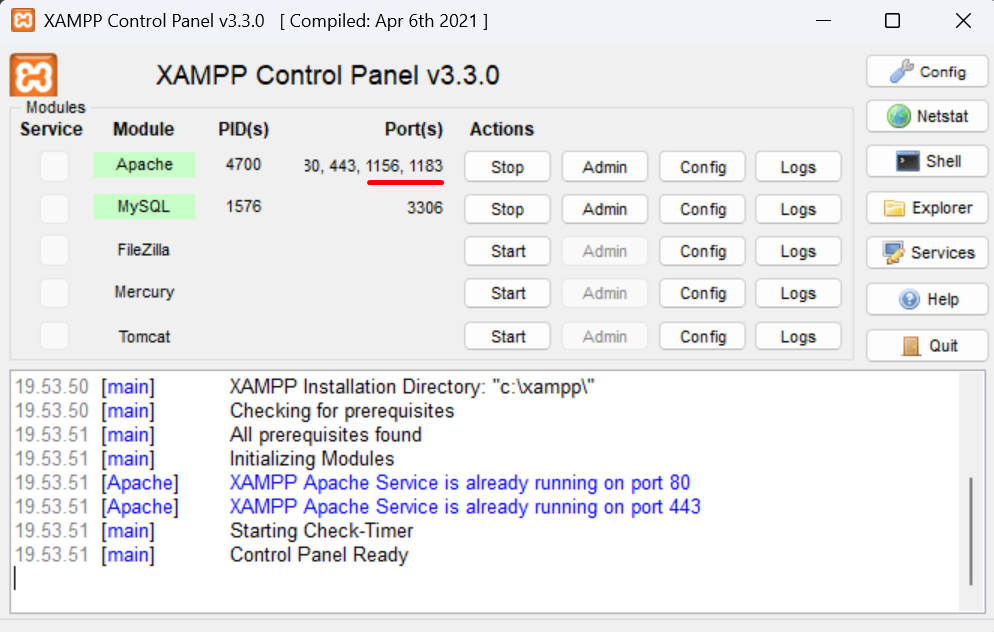
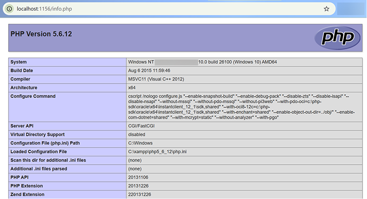
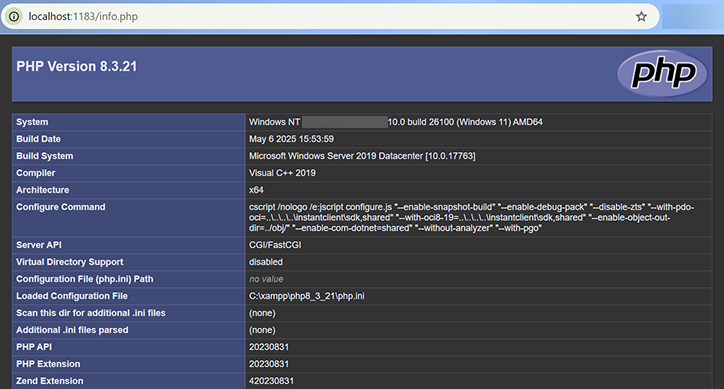

# XAMPP Multi PHP Versions

Hi Future Developer,

Welcome to the **XAMPP Multi PHP Versions** setup guide! This project is a tutorial for configuring multiple PHP versions within a single XAMPP installation using custom ports for each version.

This guide is designed for developers who need to run legacy projects alongside modern ones or test their applications across different PHP environments without the hassle of multiple XAMPP installations.

## Dazzling Tech Stack

- [XAMPP](https://www.apachefriends.org/) - Local Server Environment
- [PHP](https://www.php.net/) - Server-side language
- [Apache](https://httpd.apache.org/) - Web Server

## First Preparation

Before starting, you need to download the **PHP Binaries** first. You can download them via the following link: [https://novadev.my.id/4Vufz0Q](https://novadev.my.id/4Vufz0Q).

After downloading, extract the PHP binary zip file into your XAMPP installation directory (e.g., `C:\xampp\`). Ensure the folder name matches the version, such as `C:\xampp\php5_6_12` or `C:\xampp\php8_3_21`.

> **Warning:** Pay close attention to the PHP binaries folder name when extracting it to your XAMPP directory. The examples in this guide use the `C:\xampp\` directory.

## Configuration Steps

### 1. Configure php.ini

Go to your PHP binaries folder and look for the `php.ini` file. If it doesn't exist, copy `php.ini-production` and rename it to `php.ini`.

Open `php.ini` and make the following changes:
- **Enable extension_dir**: Find `;extension_dir` and remove the `;` to activate it. Set its value to the absolute path of your PHP version's `ext` folder.
  - Example for PHP 5.6.12: `extension_dir = "C:\xampp\php5_6_12\ext"`
  - Example for PHP 8.3.21: `extension_dir = "C:\xampp\php8_3_21\ext"`
- **Enable Essential Extensions**: Search for the `Dynamic Extensions` section and uncomment the extensions required for your projects by removing the `;` prefix. The following are commonly used: `bz2, curl, fileinfo, gd, gettext, intl, mbstring, exif, odbc, mysqli, pgsql, openssl, pdo_mysql, pdo_odbc, pdo_pgsql, pdo_sqlite, sqlite3, zip`.

> **Note:** Just a heads up: extensions depend on the PHP version. Check your `ext` folder to see what you've got to work with.

### 2. Edit httpd-xampp.conf

Open your original XAMPP `C:\xampp\apache\conf\extra\httpd-xampp.conf` file. Scroll to the very bottom and add the following configuration code according to the PHP version you are using.

**Example for PHP 8.3.21 (Port 1183):**

```apache
ScriptAlias /php8_3_21/ "C:/xampp/php8_3_21/"
<Directory "C:/xampp/php8_3_21">
    AllowOverride None
    Options None
    Require all denied
    <Files "php-cgi.exe">
          Require all granted
    </Files>
</Directory>

Listen 1183
<VirtualHost *:1183>
    UnsetEnv PHPRC
    <FilesMatch "\.php$">
        php_flag engine off
        SetHandler application/x-httpd-php8_3_21
        Action application/x-httpd-php8_3_21 "/php8_3_21/php-cgi.exe"
    </FilesMatch>
</VirtualHost>
```

**Example for PHP 5.6.12 (Port 1156):**

```apache
ScriptAlias /php5_6_12/ "C:/xampp/php5_6_12/"
<Directory "C:/xampp/php5_6_12">
    AllowOverride None
    Options None
    Require all denied
    <Files "php-cgi.exe">
          Require all granted
    </Files>
</Directory>

Listen 1156
<VirtualHost *:1156>
    UnsetEnv PHPRC
    <FilesMatch "\.php$">
        php_flag engine off
        SetHandler application/x-httpd-php5_6_12
        Action application/x-httpd-php5_6_12 "/php5_6_12/php-cgi.exe"
    </FilesMatch>
</VirtualHost>
```

You can add as many PHP versions as you need by repeating the pattern above and adjusting the ports and directory names accordingly.

### 3. Create info.php File

Open the `C:\xampp\htdocs` directory and create a new file named `info.php`. Insert the following code:

```php
<?php phpinfo(); ?>
```

This file only needs to be created once for all the PHP versions you configure.

### 4. Restart XAMPP

Once all configurations are complete, please restart Apache through the XAMPP Control Panel. If successful, the ports you have opened will appear as shown in the image below:



## Testing PHP Versions

After Apache is running again, you can test each PHP version by accessing the following URLs in your browser:

- **PHP 5.6:** [http://localhost:1156/info.php](http://localhost:1156/info.php)

  

- **PHP 8.3:** [http://localhost:1183/info.php](http://localhost:1183/info.php)

  

---

**Happy coding!**

— Nova Ardiansyah

